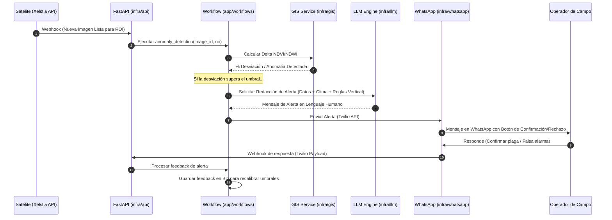

# Arquitectura y Flujo de Datos - XELSTIA

Este documento describe la especificación técnica de la arquitectura desacoplada y orientada a eventos para el **Decision Intelligence Engine** de XELSTIA.

---

## 1. Diseño de la Arquitectura (Clean Architecture)

El sistema se estructura para aislar las reglas de negocio críticas de los detalles tecnológicos cambiantes:

```text
               ┌──────────────────────────────┐
               │    knowledge (Reglas/Prompt) │
               └──────────────┬───────────────┘
                              ▼
┌──────────────────┐   ┌──────────────┐   ┌───────────────────────────┐
│ infrastructure   ├──►│ application  ├──►│ core                      │
│ (FastAPI, LLM,   │   │ (Workflows/  │   │ (Entidades/Modelos Puros) │
│  Twilio, GIS)    │   │  Use Cases)  │   │                           │
└──────────────────┘   └──────────────┘   └───────────────────────────┘
```

* **Core:** Contiene las entidades puras del dominio (ej. `Parcela`, `Alerta`, `Cliente`). No tiene dependencias de librerías de terceros ni frameworks.
* **Application:** Define los casos de uso específicos del negocio (ej. `anomaly_detection.py`). Coordina el flujo de datos hacia y desde el core y la infraestructura.
* **Infrastructure:** Implementa los detalles técnicos y adaptadores externos. Si cambiamos la API del clima de OpenWeather a Meteoblue, solo modificamos la clase adaptadora en `infrastructure/weather/`.

---

## 2. Diagrama de Secuencia: Flujo de Alerta y Feedback Loop

Este diagrama muestra el flujo completo de la información desde que el satélite genera el evento hasta que el usuario final envía su feedback de confirmación o rechazo:



---

## 3. Flujo de Datos Detallado

### Paso 1: Ingesta del Evento
El satélite procesa una nueva imagen y dispara un webhook REST a nuestro endpoint de API (`/api/v1/telemetry`):
```json
{
  "event": "image.processed",
  "image_id": "img_20260619_001",
  "roi_id": "roi_vineyard_mendoza_09",
  "resolution": "1.2m",
  "bands": ["red", "nir", "swir"]
}
```

### Paso 2: Evaluación en la Capa GIS
El caso de uso `anomaly_detection.py` toma la imagen y calcula los índices:
* **NDVI (Vigor):** $(NIR - Red) / (NIR + Red)$
* **NDWI (Humedad):** $(NIR - SWIR) / (NIR + SWIR)$
Si los valores caen por debajo de la media histórica de la parcela según las reglas en `knowledge/agriculture/ndwi_thresholds.md`, se clasifica como **Anomalía Crítica**.

### Paso 3: Contextualización por IA
El motor LLM (`infrastructure/llm/alert_drafter.py`) recibe:
1. Datos de anomalía (ej: `ndwi_drop: -18%`).
2. Clima actual e histórico (ej: `temp: 32°C, humedad: 78%`).
3. Reglas de la vertical (`knowledge/agriculture/crop_signals.md`).
4. **Instrucción de Prompt:** Traducir a una alerta clara orientada a la acción.

### Paso 4: Cierre del Loop (Ground Truth)
El usuario final recibe la alerta interactiva en su teléfono. Al presionar "Confirmar plaga" o "Falsa alarma", el sistema almacena esta respuesta vinculada al ID de la imagen satelital. Este dataset se utiliza para optimizar automáticamente los umbrales de detección y re-entrenar modelos específicos de clasificación en la nube.
